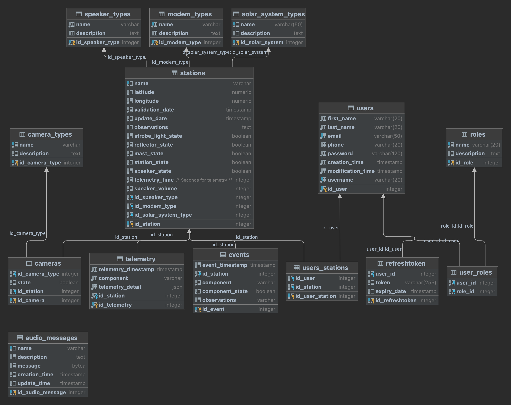

<h2>Descripción del proyecto</h2>

Base de datos del proyecto estaciones remotas de seguridad (robocop)

<h3>Diseño de la base de datos</h3>

**Modelo entidad relación**

**Tablas**

- audio_messages: Tabla con las rutas de acceso a los audios

- camera_types: Tabla con la configuración y estado de las camaras para la estación

- events: Tabla con los eventos de los diferentes nodos

- modem_types:  Tabla con los tipos de modem de internet

- modems: Tabla con los modem asignados a las estaciones

- roles: Roles para los usuarios

- solar_power_systems: Tabla con información de los sistemas de energía solar

- speaker_types: Tabla con los tipos de parlantes

- speaker: Tabla con los parlantes asignados a las estaciones

- stations: Tabla con la información y estado de las estaciones

- telemetry: Tabla con la información de telemetria de los sistemas de energía solar e internet para las estaciones

- users: Tabla con los usuarios del sistema

- users_stations: Tabla con los permisos de acceso para visualizar información de estaciones en particular para los usuarios generales

**Como Ejecutar**

<ul>
<li>Clonar el repositorio</li>
<li>Configurar las variables de entorno. En el archivo Dockerfile modificar la variable de entorno <code>POSTGRES_PASSWORD</code> para establecer la contraseña de la base de datos, el usuario por defecto es <b>postgres</b>, el password por defecto es <b>1111</b></li>
<li>Construir la imagen. Debe estar en la carpeta raiz y usar el siguiente comando <code>docker build -t robocop_db .</code>, que creara una imagen tomando como base el Dockerfile y que se nombrara como <b>robocop_db</b></li>
<li>Ejecutar la imagen para construir un docker. Ejecutar el comando <code>docker run -d -p 5433:5432 robocop_db</code>, por defecto postgres expone el servicio en el puerto 5432, con el comando anterior se expone en la maquina local en el puerto <b>5433</b></li>
<li>La base de datos por defecto tiene como nombre <b>robocop_db</b></li>
</ul>

**Para Obtener un backup de la base de datos**
<ul>
<li><code>docker exec -t your-db-container pg_dump -h localhost -p 5432 -c -F c -U postgres -f database.backup robocop_db</code></li>
<li><code>docker cp your-db-container:database.backup .</code></li>
</ul>
